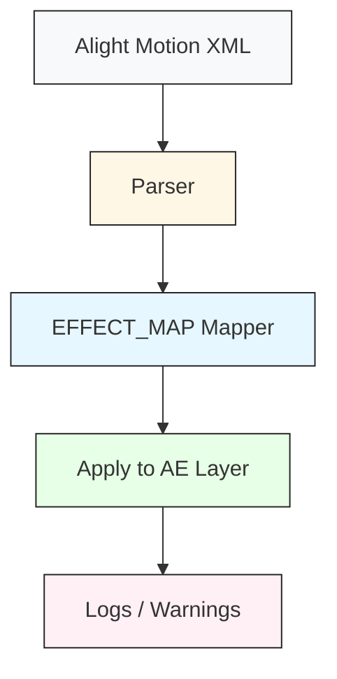

# AstridXMLtoAE

**Author:** AstridKI

---

## Description
AstridXMLtoAE is an After Effects script that imports XML data from **Alight Motion** and maps Alight Motion effects and keyframes to equivalent After Effects effects and properties.  
The script provides partial automation for effect transfer, logs unconvertible elements, and serves as a bridge between AM XML exports and AE.

> ⚠️ Some Alight Motion effects may not have direct equivalents in After Effects. Those will be logged.

---

## Features / Supported Effects

The script currently supports the following effects:

| AM Effect Key           | AE Effect Name           | Properties |
|-------------------------|-------------------------|------------|
| 360-reorient-sphere     | DKT Reorient Sphere     | Orientation, Rotation |
| streaks-spin            | Spin Streaks            | Sweep, Alpha, Bias, R, G, B, A |
| turbulentdisplace       | DKT Turbulent Displace  | Direction, Evolution, Intensity |
| zoomblur                | Zoom Blur               | Strength |
| rgbsep                  | RGB Split               | Strength |
| shake                   | Auto-Shake              | Magnitude, Frequency, Evolution, Seed, Angle, Slack, Z Shake |
| tile                    | Tiles                   | Crop |
| circularripple          | Circular Ripple         | Frequency, Strength, Phase, Radius, Feather |
| dblur                   | DKT Directional Blur    | Strength, Angle |
| gaussianblur            | DKT Gaussian Blur       | Strength |
| vignette                | DKT Vignette            | Size, Roundness, Feather, Strength, Tint, Color, Punch Out |
| wavewarp                | DKT Wave Warp           | Phase, Angle, Magnitude, Spacing, Warp Angle, Damping, Damping Space, Anchor, Screen Space |
| exposure                | Exposure/Gamma          | Exposure, Gamma, Offset |
| fractalwarp             | Fractal Warp            | Position, Parallax, Magnitude, Detail, Lacunarity, Screen Space, Octaves |
| pinchbulgeinside        | Inner Pinch/Bulge       | Strength, Radius, Feather, Use Gaussian |
| linearstreaks           | Linear Streaks          | Strength, Angle, Alpha, Bias, R, G, B, A |
| motionblur              | Motion Blur             | Tune, Position, Scale, Angle |
| oscillate               | Oscillate               | Direction, Angle, Frequency, Magnitude, Wave, Phase |
| pinchbulge              | Pinch/Bulge             | Radius, Strength |
| pulsate                 | Pulse Size              | Frequency, Grow, Shrink, Phase, Wave |
| swing                   | Swing                   | Angle1, Angle2, Frequency, Phase, Type |
| transform               | Raster Transform        | Scale, Angle, Mask To Layer, Alpha, Fill, Sampling |
| squeeze                 | Squeeze                 | Strength |
| stretch                 | Stretch Axis            | Scale, Angle, Mask to Layer |
| swirl                   | Swirl                   | Strength, Radius |
| randomdisplace          | Random Displacement     | Magnitude, Evolution, Seed, Scatter |

---

## Quick Start
1. Copy `AstridXMLtoAE.jsx` to your After Effects Scripts folder.
2. Restart After Effects.
3. Run the script from `File > Scripts > Run Script File...`.
4. Select an Alight Motion XML file.
5. Follow the console/log output to review any effects or properties that could not be mapped automatically.

---

## Architecture (diagram)

