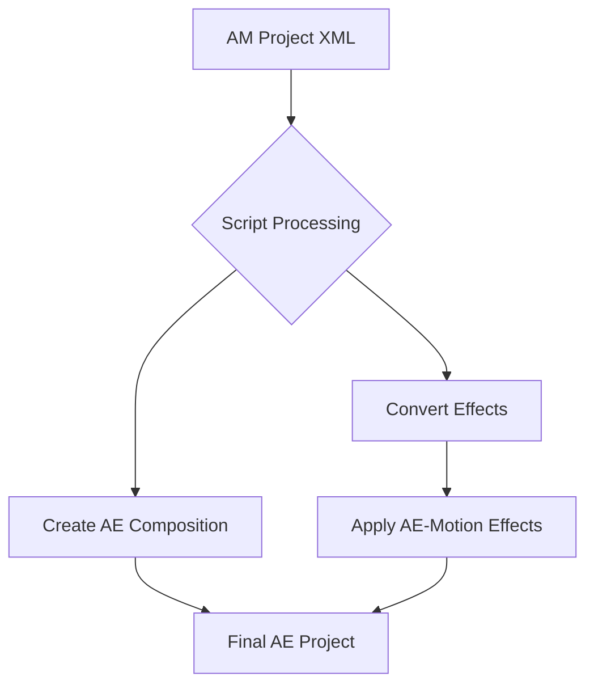

# 🎬 Alight Motion XML → After Effects Converter  

**Automatically transfer AM effects to AE with AE-Motion plugin support**  

## 🔥 Features  

✅ **1-Click Conversion** – Just select your Alight Motion XML file  

---

## 📊 Supported Effects Mapping  

| Alight Motion Effect | After Effects Equivalent | Plugin Used |
|----------------------|--------------------------|-------------|
| `shake`              | Auto-Shake               | **AE-Motion**     |
| `dblur`              | Directional Blur         | **AE-Motion**     |
| `wavewarp`           | Wave Warp                | **AE-Motion**     |
| `gaussianblur`       | Gaussian Blur            | **AE-Motion**     |
| `vignette`           | Vignette                 | **AE-Motion**     |
| `pinchbulge`         | Pinch/Bulge              | **AE-Motion**     |
| ...plus 15+ more     |                          |                   |

---

## 🛠 How It Works  

## 🚀 Quick Start  

1. Open After Effects  
2. Go to: `File > Scripts > Run Script File...`  
3. Select the converter script  
4. Choose your Alight Motion XML file  
5. Let the magic happen!  

---

## 📝 Notes  

• Works with AE 2020  
• ATTENTION!!! THE SCRIPT DOES NOT TRANSFER MOVEMENT GRAPHICS. THIS MUST BE DONE BY YOURSELF
